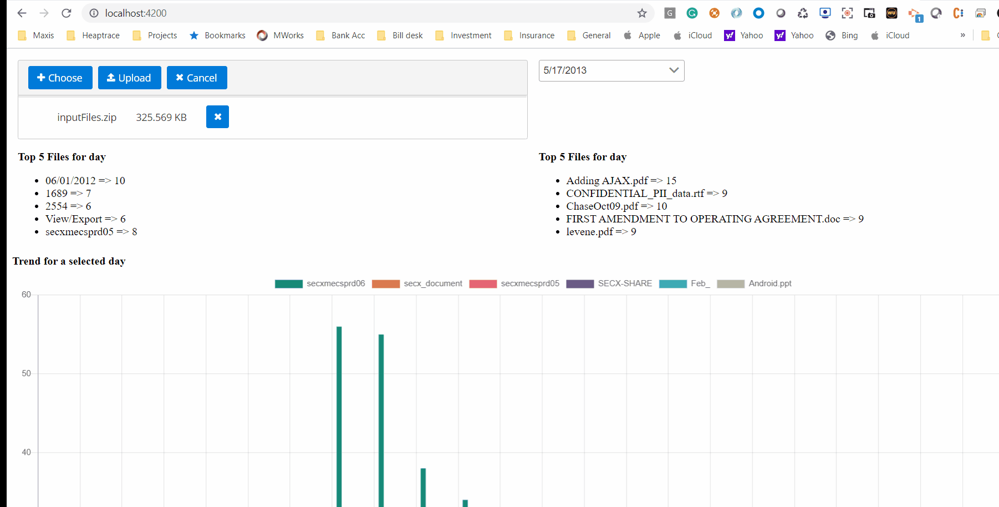

# Securonix TrendProcessing App using Springboot + Angular9(PrimeNG 9) + Maven

# Backend Run
- mvn clean springboot:run

Will start backend service on 
- http://localhost:8080

# API consumed by Frontend
localhost:8080/securonix/process-securonix-data

# Frontend Run
Install Angular 9 CLI

- ng serve

Will start application at 
- http://localhost:4200

